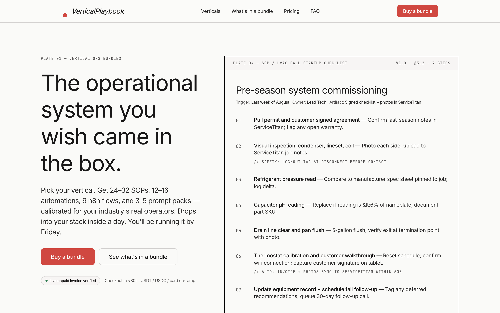
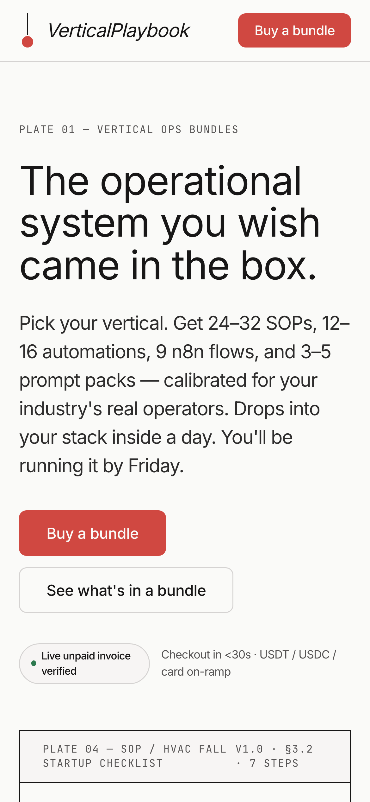

# VerticalPlaybook — `industry-process-templates`

> Operational architecture for the verticals that build the world.

A marketplace of vertical-specific operational bundles — SOPs, automations, n8n flows, and prompt packs — calibrated by industry and deployable in a day.

**Live:** [industry-process-templates.prin7r.com](https://industry-process-templates.prin7r.com)
**Notion opportunity:** [Industry process templates](https://www.notion.so/Industry-process-templates-3543ceec26198166b90ac8df25836629)
**Wave:** Prin7r Wave 2 · 2026-05-08

---

## Repository layout

```
.
├── DESIGN.md                       # Canonical design + style guide (15 sections)
├── README.md                       # This file
├── LICENSE                         # MIT (code) — bundles separately licensed
├── Dockerfile.landing              # Multistage Next.js standalone image
├── docker-compose.yml              # Single landing service + Traefik labels
├── .env.example                    # Public env shape — copy to .env on deploy
├── .gitignore
├── .github/
│   └── workflows/
│       └── landing-build.yml       # Validates `next build` on PRs to main
├── apps/
│   ├── landing/                    # Next.js 15 + Tailwind + ShadCN — production landing
│   │   ├── app/                    # App Router pages + API routes
│   │   │   ├── api/checkout/nowpayments/route.ts
│   │   │   ├── api/webhooks/nowpayments/route.ts
│   │   │   ├── globals.css
│   │   │   ├── layout.tsx
│   │   │   └── page.tsx
│   │   ├── components/             # Project-owned components (BlueprintHero, VerticalGrid, ...)
│   │   ├── components/ui/          # ShadCN primitives (Button, Card, Badge, Accordion)
│   │   └── lib/                    # env, signatures, tiers, verticals
│   └── app/                        # open-saas fork stub — Wave 3 deliverable
└── docs/
    ├── 01-brand-identity.md
    ├── 02-architecture.md
    ├── 03-user-journeys.md
    ├── 04-pain-points.md
    ├── 05-audience-profile.md
    ├── 06-sales-channels.md
    ├── 07-sales-strategy.md
    ├── 08-marketing-strategy.md
    ├── 09-go-to-market.md
    ├── 10-pitch-deck.md
    ├── pitch-deck.html             # Self-contained 10-slide HTML deck
    └── screenshots/
        ├── landing-desktop.png     # 1440×900 production render
        └── landing-mobile.png      # 390×844 production render
```

---

## Screenshots





---

## Quick start (local dev)

```bash
cd apps/landing
pnpm install
cp ../../.env.example .env.local
pnpm dev
# Open http://localhost:3000
```

Without `NOWPAYMENTS_API_KEY`, checkout returns a 503 with a clear `configuration` error — the rest of the page renders fully.

---

## Production deploy

The landing deploys on `storage-contabo` (`161.97.99.120`) behind a host-network Traefik with HTTP-01 LetsEncrypt resolver.

```bash
ssh storage-contabo
mkdir -p /opt/prin7r-deploys/industry-process-templates
cd /opt/prin7r-deploys/industry-process-templates
git clone https://github.com/prin7r-projects/industry-process-templates.git .
cp .env.example .env
# populate NOWPAYMENTS_API_KEY + NOWPAYMENTS_IPN_SECRET in .env
docker compose build
docker compose up -d
```

Verify within 5 minutes:

```bash
curl -sI https://industry-process-templates.prin7r.com
```

Expect: `HTTP/2 200` with valid Let's Encrypt cert.

---

## Payment integration — NOWPayments

This is the default and only crypto rail wired in Wave 2. Per Prin7r's payment strategy, NOWPayments is the verified production rail (USDT/USDC + card on-ramp). Plisio and Reown are documented as future rails in `.env.example`.

**Buy flow.** Pricing tier card → `POST /api/checkout/nowpayments` → server creates a hosted invoice via `POST https://api.nowpayments.io/v1/invoice` → returns `{ checkoutUrl }` → browser redirects to NOWPayments hosted invoice.

**Webhook.** NOWPayments POSTs the IPN to `/api/webhooks/nowpayments`. The handler verifies `x-nowpayments-sig` (HMAC-SHA512 over sorted-keys JSON of the payload) using `NOWPAYMENTS_IPN_SECRET` before any state read. Verification uses constant-time comparison.

See `apps/landing/lib/signatures.ts` for verification logic and `docs/02-architecture.md` for the full data flow.

---

## DESIGN.md

The canonical design + style guide is at `DESIGN.md`. All landing-page changes update DESIGN.md alongside the code.

---

## License

The code in this repo is MIT — see `LICENSE`. The VerticalPlaybook *bundles* (SOPs, automations, n8n flow exports, prompt packs) sold to buyers are covered by a separate single-implementation commercial license documented at delivery time.
