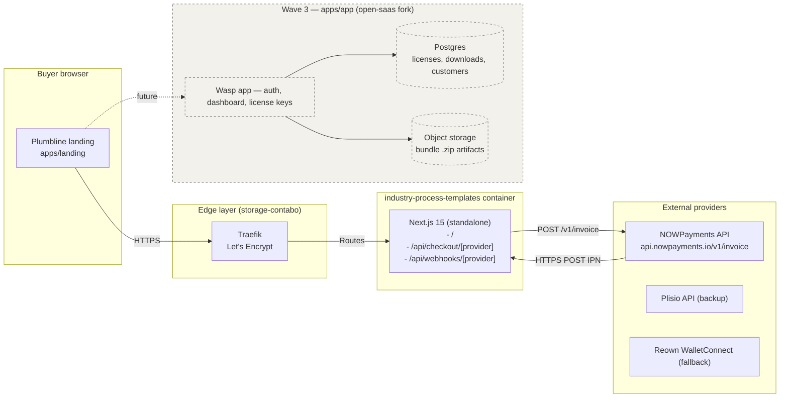

# 02 — Architecture

## System diagram



## Components

### `apps/landing` — Next.js 15 (App Router)

- **Marketing surface.** Hero, vertical grid, bundle anatomy, pricing, FAQ, footer.
- **Server-side checkout.** `app/api/checkout/[provider]/route.ts` accepts `POST` with `{ tier, bundle? }`. For `nowpayments` (the only provider wired in v1), the handler creates a hosted invoice via `POST https://api.nowpayments.io/v1/invoice` and redirects the buyer to the returned `invoice_url`.
- **Webhook handler.** `app/api/webhooks/[provider]/route.ts` accepts the provider IPN payload, verifies HMAC-SHA512 over the sorted-keys JSON using `NOWPAYMENTS_IPN_SECRET`, and (in v1) logs the event. Order persistence is in-memory only — Wave 3 swaps in Postgres via the open-saas fork.
- **Static.** `app/page.tsx` is fully static at build time except the checkout fetch handlers; the hero figure is inline SVG so there is no static-asset round trip.

### `apps/app` — open-saas fork (stub for Wave 3)

Folder exists with `.gitkeep` and a `README.md` describing the fork plan. Auth, license generation, bundle download tokens, customer dashboard, refund tooling all live here. Not built in this Wave 2 batch.

### Edge

`storage-contabo` runs a host-network Traefik (`dokploy-traefik`) with HTTP-01 letsencrypt resolver. The container exposes port 3000 and Traefik routes `industry-process-templates.prin7r.com → :3000` over TLS.

### External

- **NOWPayments** (default) — `api.nowpayments.io/v1/invoice` for hosted checkout. IPN webhook posts to `/api/webhooks/nowpayments` with `x-nowpayments-sig` HMAC-SHA512.
- **Plisio** (backup) — wired as `coming soon` button in v1; full integration deferred to a polish pass.
- **Reown** (wallet fallback) — wired as `coming soon` button in v1; deferred.

## Data flows

### Buy flow (v1)

1. Buyer lands on `/`.
2. Buyer clicks "Buy" on a pricing tier card.
3. Browser `fetch('/api/checkout/nowpayments', { method: 'POST', body: JSON.stringify({ tier: 'vertical-pack' }) })`.
4. Server constructs the invoice request: `price_amount: 1490`, `price_currency: 'usd'`, `pay_currency: 'usdttrc20'`, `ipn_callback_url: '<APP_URL>/api/webhooks/nowpayments'`, `success_url`, `cancel_url`.
5. NOWPayments returns `{ id, invoice_url, ... }`.
6. Server returns `{ checkoutUrl }` to the browser; browser navigates the buyer to the hosted invoice page.
7. Buyer pays in the hosted page.
8. NOWPayments POSTs IPN to `/api/webhooks/nowpayments` with payment status. Server verifies signature, logs the event. (v1 ends here; Wave 3 triggers license generation and bundle delivery.)

### Webhook verification

```
expected = HMAC-SHA512(NOWPAYMENTS_IPN_SECRET, JSON.stringify(sortObjectKeys(payload)))
provided = request.headers['x-nowpayments-sig']
verify   = timingSafeEqual(expected, provided)
```

## Deploy topology

| Environment | Host | Path | Notes |
|---|---|---|---|
| Production | `storage-contabo` (`161.97.99.120`) | `/opt/prin7r-deploys/industry-process-templates` | docker compose up -d |
| Reverse proxy | host-network Traefik | `dokploy-traefik` | HTTP-01 LE resolver |
| DNS | Cloudflare wildcard `*.prin7r.com → 161.97.99.120` | already in zone | no per-subdomain DNS needed |
| Source | `github.com/prin7r-projects/industry-process-templates` | main branch | manual `git pull && docker compose build && docker compose up -d` for v1 |

## Failure modes and mitigations

| Failure | Mitigation |
|---|---|
| NOWPayments API 5xx during checkout | Server returns 502 with body `{ error: 'provider-unavailable', retryAfter: 60 }`; landing shows inline error state with a `mailto:` fallback. |
| NOWPayments IPN signature mismatch | Server returns 401, logs `verify_failed` with truncated payload preview, does **not** mutate any order state. |
| Container OOM during build | Dockerfile uses Node 22 alpine; build memory cap is 1GB; if hit, fall back to `pnpm install --no-optional` (deferred). |
| Domain HTTPS fails | Cloudflare wildcard already issued for `*.prin7r.com`; Traefik retries LE every 15min. Manual `docker logs dokploy-traefik` for ACME state. |

## Security boundaries

- `.env` is gitignored; live keys live only on `storage-contabo:/opt/prin7r-deploys/industry-process-templates/.env`.
- Webhook endpoint validates HMAC before any state read or mutation.
- Server has no direct DB connection in v1; in-memory order log resets on container restart.
- No PII collected on the landing — buyer email is captured by NOWPayments hosted invoice, not by us.
