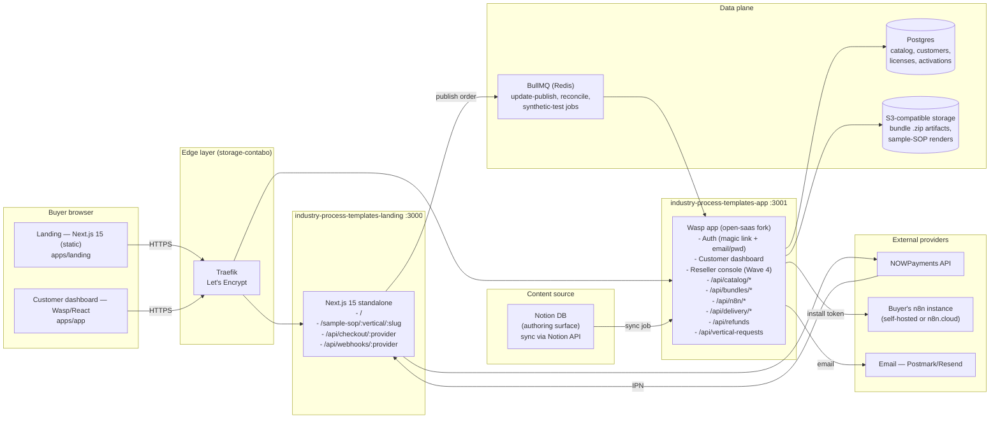
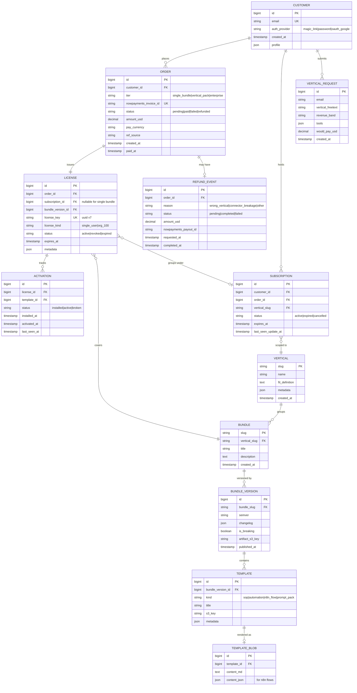

# 12 — Technical Specification

This document is the engineering input contract for the Phase 2 SaaS implementation agent. It assumes doc 11 (user stories) is the source-of-truth for what gets built; this doc defines how. The current Wave 2 build is the static landing in `apps/landing/` plus the `apps/app/` open-saas stub. Phase 2 (Wave 3) implements the SaaS app. v1's static landing already implements the catalog browse + NOWPayments hosted-checkout flow; the spec below extends rather than replaces that surface.

---

## 1. Architecture overview

VerticalPlaybook is a vertically integrated content marketplace: a catalog UI, a content store, an n8n integration layer, a payments adapter, and a license-bound delivery service. Doc 02 covers the v1 static landing topology; this section adds the Wave 3 runtime detail.

### Runtime topology (Wave 3 target state)

### Services

| Service | Path | Port | Stack | Purpose |
|---|---|---|---|---|
| `landing` | `apps/landing` | `:3000` | Next.js 15 standalone | Marketing surface + checkout entry + IPN handler (already shipped in v1) |
| `app` | `apps/app` | `:3001` | Wasp 0.14+ (open-saas fork) | Auth, dashboard, catalog read API, license + delivery service, n8n integration, refund flow |
| `worker` | `apps/app/worker` | n/a | BullMQ on Redis | Background jobs: NOWPayments reconcile, Notion-sync, synthetic n8n tests, update-publish |
| `redis` | `services/redis` | `:6379` (internal) | Redis 7 | BullMQ queue store + ephemeral install-token cache |

### Deploy topology (Wave 3 target)

| Component | Host | Path | Notes |
|---|---|---|---|
| Landing | `storage-contabo:161.97.99.120` | `/opt/prin7r-deploys/industry-process-templates/landing` | docker compose up -d (already live) |
| App | same host | `/opt/prin7r-deploys/industry-process-templates/app` | new Wave 3 deploy |
| Worker | same host | `/opt/prin7r-deploys/industry-process-templates/worker` | sidecar to app |
| Postgres | same host | dokploy-managed Postgres 16 | volume backups daily |
| Redis | same host | docker-compose internal network | not exposed externally |
| S3-compatible | Contabo Object Storage (existing tenancy) | `bucket: verticalplaybook-bundles` | private bucket, signed URLs only |
| Reverse proxy | host-network Traefik (`dokploy-traefik`) | n/a | routes `industry-process-templates.prin7r.com` → landing, `app.industry-process-templates.prin7r.com` → app |

### Dependencies

- `landing` depends on `app` only via webhook fan-out (the IPN handler enqueues a `process-payment` job that the worker consumes). v1 is fully self-contained and remains so until `app` ships.
- `app` depends on `redis` (synchronous for queue), `postgres` (synchronous), `s3` (lazy, async for downloads).
- `worker` depends on `redis`, `postgres`, and `notion-api` (for the content sync job), plus outbound to NOWPayments + email.

---

## 2. Data model

The schema below covers MVP (catalog + customer + license + activation). Wave 4 entities (`Reseller`, `ChildLicense`, `WatermarkToken`) are flagged but not specified in detail.

### ER diagram

### Indexes (initial set)

- `customer.email` — unique
- `order.nowpayments_invoice_id` — unique
- `license.license_key` — unique
- `license.order_id` — for lookup by purchase
- `license (subscription_id, bundle_version_id)` — for "what's in my pack"
- `activation (license_id, template_id)` — unique composite
- `bundle_version (bundle_slug, semver)` — unique composite
- `vertical_request.created_at` — for admin reports
- `refund_event.order_id` — one-to-one inferred but indexed for join

### Retention

- Orders, licenses, activations: retained indefinitely (audit + compliance).
- `vertical_requests`: 24 months rolling.
- IPN raw payloads: 90 days hot in DB, then archived to S3 cold storage.

---

## 3. API contracts

All Wave 3 app endpoints are versioned at `/api/v1/`. Auth model: cookie session for browser-originated requests, bearer token (license key) for service-to-service calls (e.g. `n8n-install-token` redemption). All endpoints return JSON with the shape `{ data, error }`. Errors use HTTP status codes plus a stable `error.code` string.

### 3.1 Catalog (read-mostly, public)

#### `GET /api/v1/catalog/verticals`

- **Auth:** none.
- **Response 200:** `{ data: Vertical[], error: null }` where `Vertical = { slug, name, fitDefinition, bundleCount, sopCount, automationCount, flowCount, promptPackCount }`.
- **Cache:** `Cache-Control: public, max-age=300, stale-while-revalidate=900`.
- **Errors:** none expected; 500 on DB outage.

#### `GET /api/v1/catalog/verticals/:slug`

- **Auth:** none.
- **Path:** `:slug` ∈ {`hvac`, `dental`, `accounting`, `dtc-ecommerce`, `brokerage`, `saas-support`, `marketing-agency`}.
- **Response 200:** `{ data: { slug, name, fitDefinition, bundles: Bundle[], sampleSops: SampleSop[] }, error: null }`.
- **Errors:** `404 vertical-not-found`.

#### `GET /api/v1/catalog/verticals/:slug/bundles`

- **Auth:** none.
- **Response 200:** `{ data: BundleSummary[], error: null }` where `BundleSummary = { slug, title, description, latestVersion, sopCount, automationCount, flowCount, promptPackCount }`.

#### `GET /api/v1/catalog/compare?verticals=:slugA,:slugB`

- **Auth:** none.
- **Query:** `verticals` — comma-separated, exactly 2 values.
- **Response 200:** `{ data: { left, right, overlap: { sopMatches: number, automationMatches: number } }, error: null }`.
- **Errors:** `400 invalid-comparison` if not exactly 2 verticals or one is unknown.

#### `GET /api/v1/catalog/sample-sop?vertical=:slug&name=:slug`

- **Auth:** none.
- **Response 200:** `{ data: { vertical, name, contentMd, plateNumber, publishedAt }, error: null }`.
- **Errors:** `404 sample-sop-not-found`.

### 3.2 Checkout (Wave 2 already wired; spec is canonical)

#### `POST /api/checkout/:provider`

- **Provider:** `nowpayments` (only). Plisio + Reown are deferred per doc 02.
- **Auth:** none (anonymous checkout — buyer email captured in NOWPayments hosted invoice, not by us).
- **Body:** `{ tier: 'single-bundle' | 'vertical-pack' | 'enterprise', bundle?: string, vertical?: string, ref?: string }`.
- **Response 200:** `{ data: { checkoutUrl: string, invoiceId: string }, error: null }`.
- **Errors:**
  - `400 invalid-tier` — tier not in enum.
  - `502 provider-unavailable` — NOWPayments 5xx; body includes `{ retryAfter: 60 }`.
- **Side effects:** creates `Order` row with `status='pending'`, persists `nowpayments_invoice_id`, links `ref_source`.

#### `POST /api/webhooks/:provider` (NOWPayments IPN)

- **Auth:** HMAC-SHA512 signature in `x-nowpayments-sig` header. Server verifies against `NOWPAYMENTS_IPN_SECRET` over `JSON.stringify(sortObjectKeys(body))`.
- **Body:** NOWPayments IPN schema (see provider docs). Critical fields: `payment_id`, `invoice_id`, `payment_status`, `pay_currency`, `actually_paid`.
- **Response 200:** `{ ok: true }` on accepted; `401 verify-failed` on signature mismatch.
- **Side effects:**
  - On `payment_status='finished'`: update `Order.status='paid'`, set `paid_at`, enqueue `process-payment` job.
  - On `payment_status='failed' | 'expired' | 'refunded'`: update status accordingly; refunded path triggers `RefundEvent`.

### 3.3 Customer (auth required)

#### `GET /api/v1/me`

- **Auth:** session cookie.
- **Response 200:** `{ data: { customer, orders, subscriptions, licenses, activations }, error: null }`.

#### `GET /api/v1/dashboard/updates`

- **Auth:** session cookie.
- **Response 200:** `{ data: BundleUpdate[], error: null }` — bundle versions published since the customer's `subscription.last_seen_update_at` for any active subscription.
- **Side effects:** none (read-only); the "mark as seen" mutation lives below.

#### `POST /api/v1/dashboard/updates/seen`

- **Auth:** session cookie.
- **Body:** `{ subscriptionId: number, asOf: ISO8601 }`.
- **Response 200:** `{ data: { ok: true }, error: null }`.

### 3.4 Bundles + delivery (auth required)

#### `GET /api/v1/bundles/:slug/versions`

- **Auth:** session cookie + license check.
- **Response 200:** `{ data: BundleVersion[], error: null }`.
- **Errors:** `403 no-license` if customer doesn't hold a license for this bundle.

#### `GET /api/v1/bundles/:slug/versions/:version/diff?against=:previous`

- **Auth:** session cookie + license check.
- **Response 200:** `{ data: { sops: SopDiff[], automations: AutomationDiff[], flows: FlowDiff[], breaking: boolean }, error: null }`.

#### `POST /api/v1/delivery/refresh-token`

- **Auth:** session cookie + license check.
- **Body:** `{ licenseId: number, bundleVersion?: string }`.
- **Response 200:** `{ data: { downloadUrl: string, expiresAt: ISO8601 }, error: null }`.
- **Side effects:** mints a single-use signed S3 URL with TTL = 24h. Token redemption recorded in audit log.

### 3.5 n8n integration (auth required)

#### `POST /api/v1/n8n/install-token`

- **Auth:** session cookie + license check.
- **Body:** `{ licenseId: number, flowId: string }`.
- **Response 200:** `{ data: { installUrl: string, token: string, expiresAt: ISO8601 }, error: null }`.
- **TTL:** 5 minutes, single-use.
- **Errors:** `403 license-mismatch` if license doesn't cover the flow's bundle.

#### `POST /api/v1/n8n/activation-callback`

- **Auth:** bearer token (the install-token's `token` field; consumed at install time and verified at callback time within TTL).
- **Body:** `{ token: string, flowId: string, status: 'active' | 'broken', n8nInstanceMeta: object }`.
- **Response 200:** `{ data: { ok: true }, error: null }`.
- **Side effects:** updates `Activation` row; records `last_seen_at`.

### 3.6 Refunds (auth required)

#### `POST /api/v1/refunds`

- **Auth:** session cookie.
- **Body:** `{ orderId: number, reason: 'wrong-vertical' | 'connector-breakage' | 'other', notes?: string }`.
- **Response 202:** `{ data: { refundEventId: number, status: 'pending' }, error: null }`.
- **Errors:**
  - `400 outside-refund-window` — order paid more than 30 days ago.
  - `409 already-refunded`.
- **Side effects:** creates `RefundEvent`, enqueues `process-refund` job (calls NOWPayments payout API), revokes license + tokens.

### 3.7 Vertical requests (anonymous)

#### `POST /api/v1/vertical-requests`

- **Auth:** none + hCaptcha token.
- **Body:** `{ email, verticalFreetext, revenueBand, tools: string[], wouldPayUsd: number, captchaToken: string }`.
- **Rate limit:** 1 req/min/IP (sliding window).
- **Response 200:** `{ data: { ok: true }, error: null }`.
- **Errors:** `400 captcha-failed`, `429 rate-limit`.

### 3.8 Admin (Wave 3+)

`GET /api/v1/admin/vertical-requests`, `GET /api/v1/admin/refund-events`, `POST /api/v1/admin/bundles/:slug/publish-version`. Auth: cookie session + role=admin (only VerticalPlaybook staff). Shape stable but full schema deferred to Wave 3 build agent.

---

## 4. Integrations

### NOWPayments

- **Auth:** API key in `X-Api-Key` header (server-to-server). IPN auth via HMAC-SHA512 with shared secret.
- **Endpoints used:** `POST /v1/invoice`, `GET /v1/payment/:id` (reconciliation), `POST /v1/payout` (refunds — Wave 3).
- **Rate limits:** 100 req/min for invoice creation per provider docs. VerticalPlaybook volume well below this in Wave 3.
- **Fallback:** on 5xx, return `502 provider-unavailable` to the buyer with `retryAfter: 60`. Plisio + Reown are wired as `coming soon` buttons in v1 — full provider abstraction lives in `apps/landing/lib/checkout.ts`.
- **Sandbox:** NOWPayments sandbox environment used for staging; toggled via `NOWPAYMENTS_BASE_URL` env var.

### Notion (content source)

- **Auth:** internal-integration token. Two databases: "Bundles" (one row per bundle) and "Templates" (one row per SOP/automation/flow/prompt-pack).
- **Sync model:** worker pulls every 15 min via `notion-api` SDK. Diff against last-known revision; on change, build new `BundleVersion` row, render markdown to S3, invalidate catalog cache.
- **Rate limits:** Notion rate-limits at 3 requests/sec/integration. Worker batches reads; backoff on 429.
- **Fallback:** if Notion outage, last-known good catalog is served from Postgres + S3. No new versions publish until sync recovers.

### n8n (buyer's instance — self-hosted or n8n.cloud)

- **Auth:** none from VerticalPlaybook side; VerticalPlaybook mints an install-token URL that opens in the buyer's n8n with import payload. The buyer's n8n imports the workflow JSON; credential wiring is the buyer's responsibility.
- **Compatibility target:** n8n ≥ 1.42 (LTS as of Wave 3 ship).
- **Activation callback:** optional first-run callback in the workflow JSON template that posts to `/api/v1/n8n/activation-callback`. Configurable; some buyers will disable it for privacy.

### Email (Postmark or Resend)

- **Auth:** API key via env var.
- **Templates:** transactional only — `purchase-confirmation`, `bundle-delivery`, `subscription-welcome`, `update-published`, `refund-confirmed`, `vertical-launched`.
- **Fallback:** failed sends queue for 24h with exponential backoff. After 3 failures, send to dead-letter and alert via Slack.

### Optional CRM webhooks (Wave 4)

- For agency resellers: `Reseller.webhook_url` receives signed webhooks on customer-license events (`license.issued`, `license.revoked`). Out of scope for Wave 3 MVP.

### hCaptcha

- Public + secret keys via env vars. Used on `POST /api/v1/vertical-requests` only.

---

## 5. Storage

### Catalog data (Wave 3 SaaS)

- **DB:** Postgres 16 (default for Wave 3). For early MVP, SQLite-backed Wasp default is acceptable for `app` if Postgres provisioning slips — but the schema above migrates 1:1, no shape changes.
- **Migration path:** Wasp uses Prisma under the hood; migrations live at `apps/app/migrations/`. Migration from SQLite → Postgres uses `prisma migrate deploy` against fresh Postgres + a one-time `pg_dump`/load script.

### Bundle artifacts

- **Storage:** S3-compatible (Contabo Object Storage). Private bucket `verticalplaybook-bundles`.
- **Layout:** `s3://verticalplaybook-bundles/<bundle_slug>/<semver>/bundle.zip` + sibling `manifest.json`, `sops/`, `flows/`.
- **Access:** signed URLs only; no public ACLs. URL TTL 24h matches download-token TTL.

### Sample SOP renders (public)

- **Storage:** `s3://verticalplaybook-bundles/public/sample-sop/<vertical>/<slug>.md` — the only public path.
- **Cache:** Cloudflare CDN in front (existing wildcard zone).

### Indexes + retention

See §2 for index list. Retention: orders/licenses indefinitely; vertical-requests 24mo rolling; raw IPN payloads 90d hot then S3 cold.

---

## 6. Auth

### Customer auth (Wave 3)

- **Primary:** magic-link email (Wasp's built-in via Postmark/Resend).
- **Secondary:** email + password (for users who prefer it; same Wasp built-in).
- **OAuth (deferred to Wave 4):** Google + GitHub via Wasp's social auth — useful for agency principals already on Google Workspace.
- **Session:** 30-day rolling cookie; secure + httpOnly + sameSite=Lax. Refresh on each request within last-7-day window.
- **Password rules:** 12-char min; bcrypt (Wasp default). No SMS/MFA in Wave 3 MVP.

### Service-to-service auth

- **License-bearer tokens:** UUID v7, scoped to `license_id`. Used for `n8n-install-token` redemption and `n8n-activation-callback`.
- **Webhook signatures:** HMAC-SHA512 over canonical JSON; secret per provider in env.

### Reseller auth (Wave 4)

- Separate role flag `customer.role='reseller'`. Resellers gain access to a sub-license-management console. Out of scope for Wave 3 MVP.

---

## 7. Security

### Secrets

- All secrets in `apps/landing/.env` and `apps/app/.env` (server-side only). `.env` is gitignored. Live keys live only on `storage-contabo:/opt/prin7r-deploys/industry-process-templates/{landing,app}/.env`.
- Secrets rotated quarterly: `NOWPAYMENTS_API_KEY`, `NOWPAYMENTS_IPN_SECRET`, `NOTION_INTEGRATION_TOKEN`, `S3_ACCESS_KEY`, `S3_SECRET_KEY`, `EMAIL_API_KEY`, `HCAPTCHA_SECRET`.

### Rate limits (per endpoint)

| Endpoint | Limit |
|---|---|
| `POST /api/v1/vertical-requests` | 1 req/min/IP |
| `POST /api/checkout/:provider` | 10 req/min/IP |
| `POST /api/v1/n8n/install-token` | 30 req/hour/license |
| `POST /api/v1/refunds` | 5 req/hour/customer |
| `GET /api/v1/catalog/*` | 120 req/min/IP (read-mostly, cached) |

### CSRF + CORS

- Cookie-authed mutations require a CSRF token (Wasp's built-in double-submit).
- CORS allowlist: `industry-process-templates.prin7r.com`, `app.industry-process-templates.prin7r.com`. No `*` ever.

### PII handling

- Customer email is the only PII collected. No payment details (handled by NOWPayments).
- No analytics that fingerprint users — Plausible (server-side, no cookies) is the only analytics in Wave 3 MVP.
- Right-to-deletion: `POST /api/v1/me/delete` (Wave 3+) anonymizes email, retains order audit trail.

### License enforcement

- Bundle .zip download served via signed URL with 24h TTL, single-use semantics (VerticalPlaybook tracks tokens; second redemption fails).
- License-encoded watermark in bundle metadata (Wave 4) — adds origin-trace to redistributed copies.
- Resale violations: license revocation via admin endpoint; future purchases blocked by email + wallet matchup.

### Audit log

- Triggered on: order creation, payment received, license issuance/revocation, refund, admin actions.
- Format: append-only `audit_events` table with `(actor, action, target_type, target_id, payload_json, created_at)`. 12-month retention.

---

## 8. Observability

### Log format

- Structured JSON to stdout. Fields: `timestamp`, `level`, `service`, `requestId`, `userId?`, `licenseId?`, `event`, `payload?`.
- Log shipping: Coolify-managed loki collector on `storage-contabo` (already deployed for sister projects).

### Metrics

Emitted to a Prometheus-compatible endpoint at `/metrics` (cookie-auth-gated; only internal monitor scrapes).

| Metric | Type | Labels |
|---|---|---|
| `verticalplaybook_purchase_funnel_total` | counter | `step ∈ {landed, viewed_vertical, opened_pricing, started_checkout, paid}`, `vertical` |
| `verticalplaybook_activation_rate` | gauge | `bundle`, `flow_id` |
| `verticalplaybook_n8n_install_duration_seconds` | histogram | `bundle` |
| `verticalplaybook_n8n_install_token_issued_total` | counter | `bundle` |
| `verticalplaybook_n8n_install_token_expired_total` | counter | `bundle` |
| `verticalplaybook_synthetic_test_failed_total` | counter | `bundle`, `flow_id`, `vendor` |
| `verticalplaybook_ipn_verify_failed_total` | counter | `provider` |
| `verticalplaybook_refund_requested_total` | counter | `reason` |
| `verticalplaybook_catalog_cache_hit_total` | counter | `endpoint` |

### Trace propagation

- W3C `traceparent` headers honored; outbound HTTP (NOWPayments, Notion) propagates the trace. OpenTelemetry SDK at the Wasp layer.

### Alert thresholds

| Alert | Condition | Channel |
|---|---|---|
| IPN verify failure spike | `>5 in 10min` | Slack #verticalplaybook-oncall |
| Synthetic test failure | any failure | Slack #verticalplaybook-oncall |
| Refund rate spike | `>10% of orders/day` | Slack + email |
| Catalog cache miss rate | `>50% sustained 30min` | Slack |
| Order without delivery email | `>0` | Slack (auto-resolves on resend) |

---

## 9. Performance budgets

| Path | p50 | p95 | p99 | Concurrency target |
|---|---|---|---|---|
| Catalog browse (`GET /api/v1/catalog/*`) | 80ms | 500ms | 1.2s | 200 RPS sustained |
| Vertical detail page render | 120ms | 700ms | 1.5s | 50 RPS sustained |
| `POST /api/checkout/:provider` (NOWPayments invoice creation) | 600ms | 2.0s | 4.5s | 5 RPS sustained |
| IPN webhook processing | 100ms | 400ms | 1.0s | 20 RPS burst |
| `POST /api/v1/n8n/install-token` (end-to-end including n8n redirect) | 1.5s | 10s | 20s | 5 RPS sustained |
| Bundle download initiation (signed URL) | 50ms | 200ms | 500ms | 50 RPS burst |
| Auth flow (magic-link sign-in) | 400ms | 1.5s | 3.0s | n/a |

Throughput target Wave 3: ~1,000 daily-active customers, ~100 purchases/month, ~500 dashboard views/day. Plenty of headroom on Contabo VPS sizing.

---

## 10. Non-goals (explicit out-of-scope)

These items are deliberately NOT built in Wave 2 or Wave 3 MVP. Future implementation agents must not add them without product approval.

1. **Custom SOP authoring service.** We do not write one-off SOPs on request. Buyers can submit a `vertical-request`; we ship if volume justifies.
2. **Compliance certification or audit pipeline.** No SOC2 questionnaire response, no HIPAA attestations, no regulatory-counsel review service. Bundles ship with baseline content; compliance review is the buyer's responsibility.
3. **Full multi-tenant SaaS for the operator.** VerticalPlaybook does not host the buyer's n8n, does not run their SOP library, does not manage their team's access. We deliver bundle artifacts; the buyer deploys into their own stack.
4. **Affiliate program.** No referral-link generation, no commission tracking. Considered Wave 4+.
5. **Localization.** v1 ships English-only, US/CA jurisdiction context. No i18n in Wave 3.
6. **Per-SOP semver / per-SOP licensing.** Whole-bundle versioning only. Wave 4 may add per-SOP version pins.
7. **Real-time collaborative SOP editing.** Out of scope. Bundles are immutable artifacts; customer customizations live in the buyer's own stack.
8. **Reseller program platform.** Wave 4+. Wave 3 MVP enforces single-implementation license but does not offer reseller-tier pricing or sub-license management UX.
9. **Mobile app.** Wave 3 customer dashboard is responsive web only. No iOS/Android native apps.
10. **Agency-platform pivot.** VerticalPlaybook is a marketplace, not an operating-system-as-a-service. Even if agency-buyer feedback pulls toward "host my retainer ops here," we do not pivot.

---

*End of doc 12.* Doc 13 (implementation plan) sequences this spec into phased work with DoD per phase.
